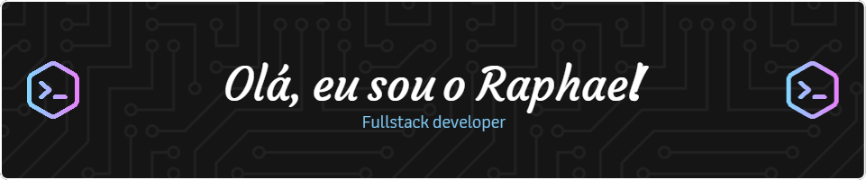

- 🔭  I’m currently working on Indra

- 🌱  I’m always studying **Android, Clean Architecture, TypeScript, NodeJS**

- 🚀  How to reach me  [raphael maracaipe](raphaelmaracaipe@gmail.com)

 

## 🛠 &nbsp;Tech Stack

&nbsp;
&nbsp;
&nbsp;
&nbsp;
&nbsp;
&nbsp;
&nbsp;

## ⚙️ &nbsp;GitHub Analytics
 

##

  

